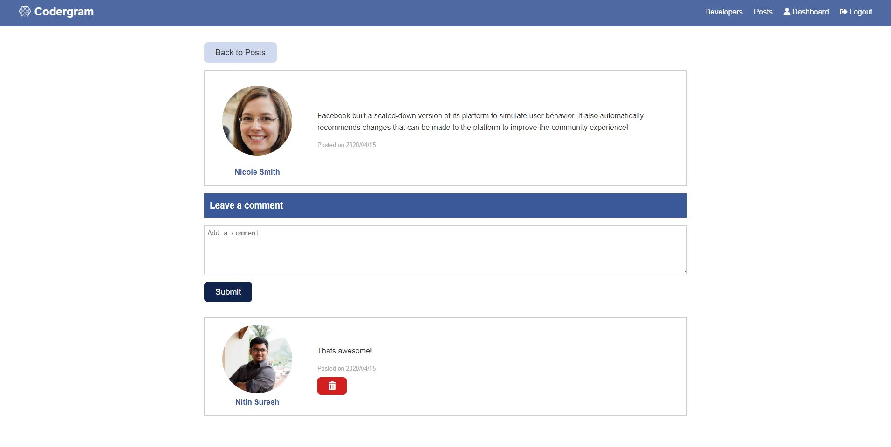
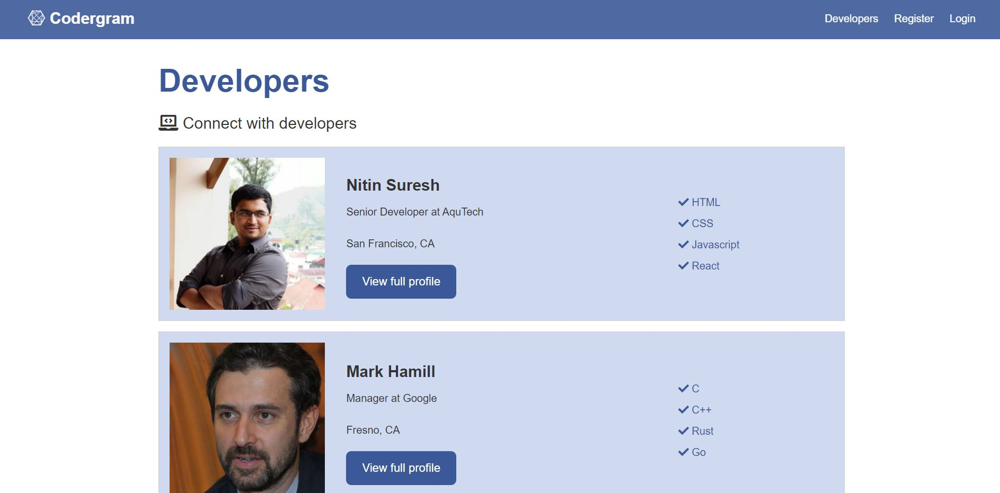
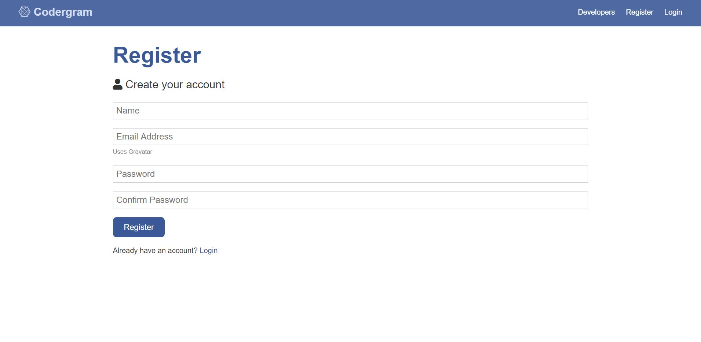

# Codergram - Social Networking application built using NodeJS, Express, React & MongoDB

Social Networking web app with user registration & login, forum posts and comments functionality, portfolio/profile creation and Github repository listing. Back-end API routes developed with Express with a React/Redux front-end.

[Live Demo](https://codergram-live.herokuapp.com/)

Screenshots:

